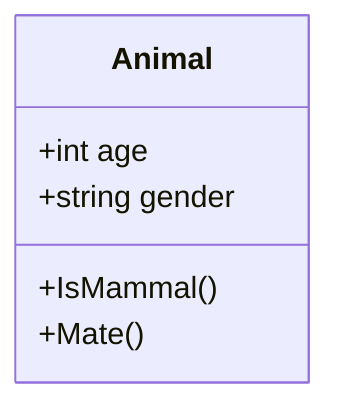
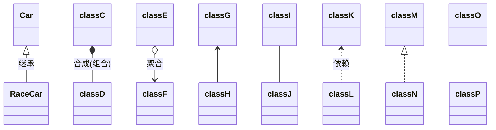
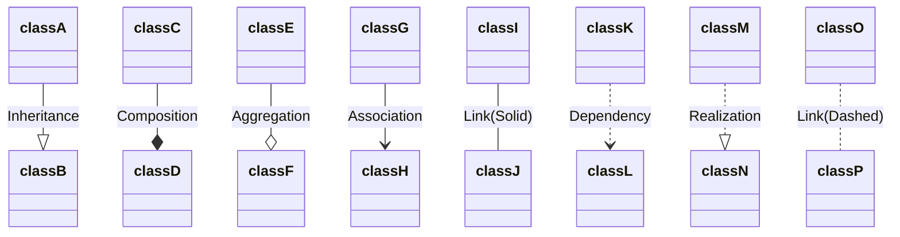

---
{"dg-publish":true,"permalink":"/Computer/计算机相关/dotnet/CSharp/未命名/类图/","created":"2025-04-06T19:54:00","updated":"2025-04-06T21:46:28.636+08:00"}
---

---
## 类





## 关系


```
classDiagram
Car <|-- RaceCar : 继承
Bird *-- > Wing : 合成(组合)
classE o-- > classF : 聚合
classG <-- classH
classI -- classJ
classK <.. classL : 依赖
classM <|.. classN
classO .. classP
```

