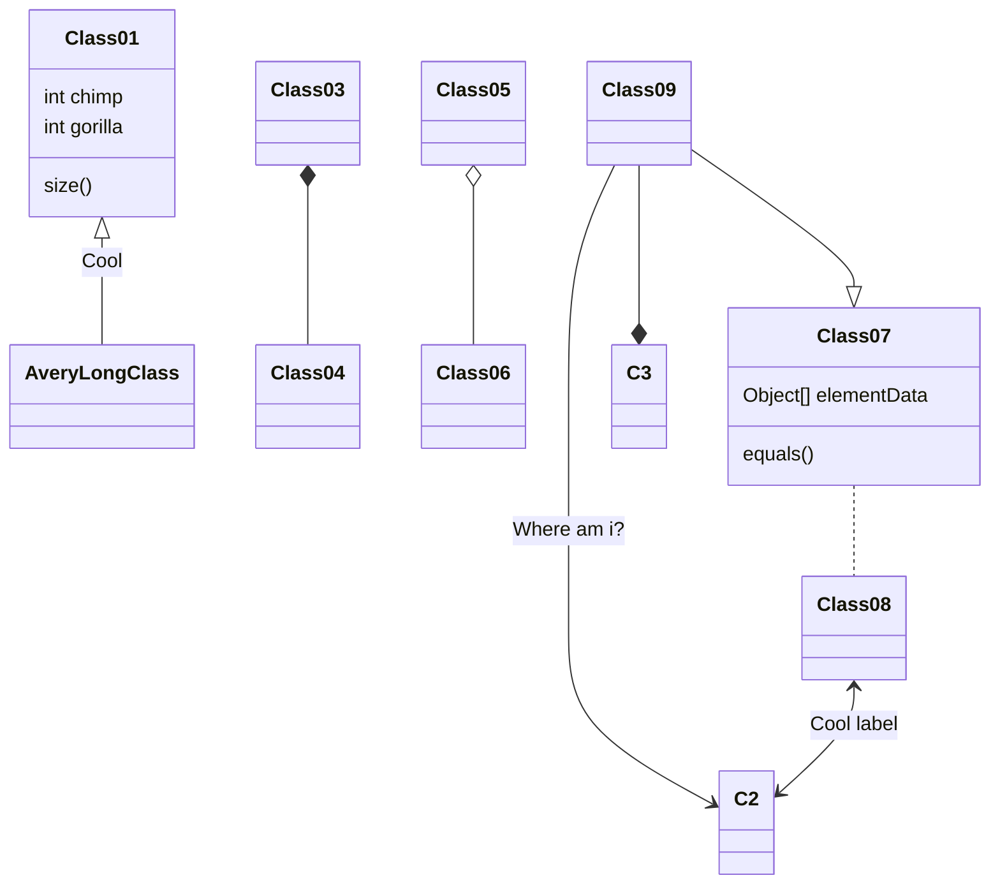
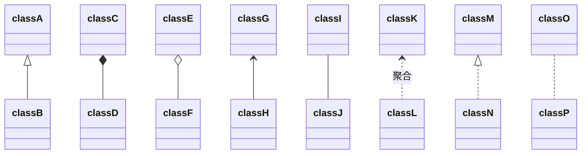
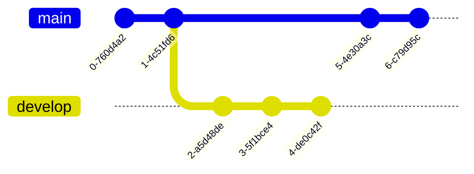
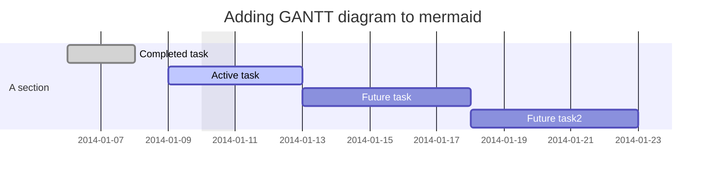
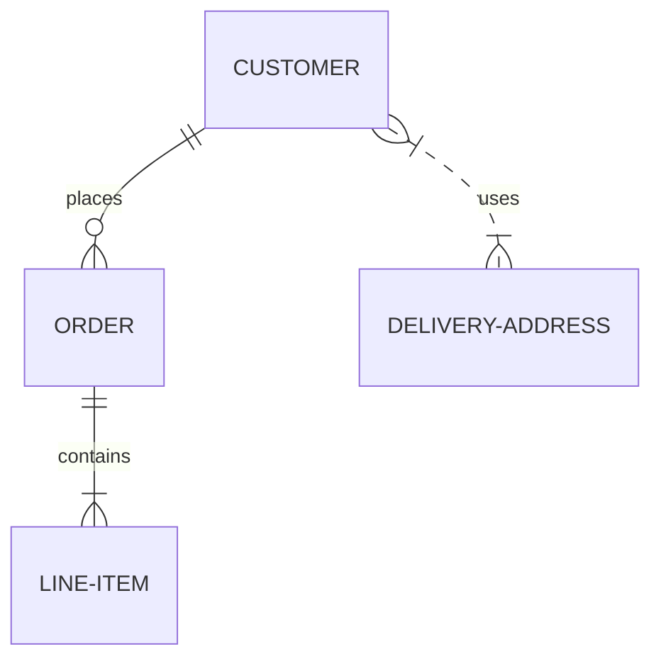
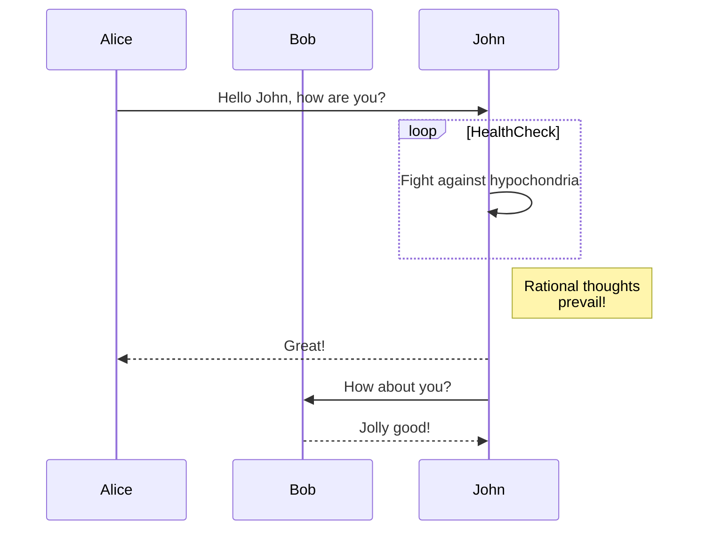
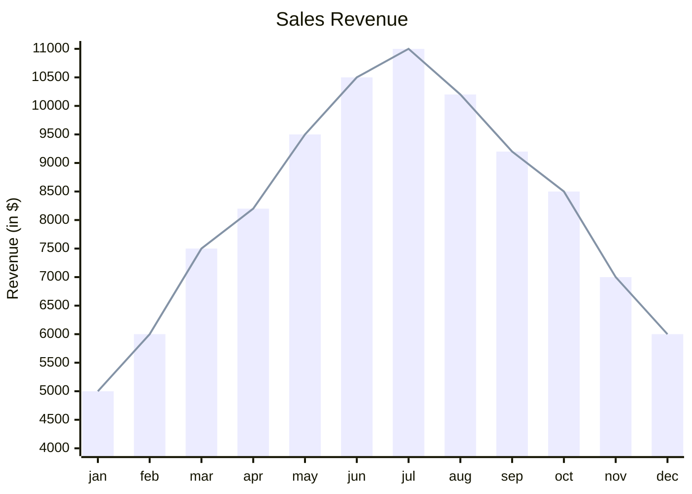

---
{"dg-publish":true,"permalink":"/Obsidian/Obsidian的一些功能/","title":"Obsidian的一些功能","tags":["gardenEntry"],"created":"2025-03-30T21:35:00","updated":"2025-04-06T21:38:57.315+08:00"}
---


---

# 官方文档

- ## [Obsidian 官方中文文档  ][Obsidian 官方中文文档]

- ## [Markdown 官方文档][Markdown 官方文档]

---

# Obsidian的一些功能

## 插入东西


---
### 嵌入内容

链接  [[Obsidian/Obsidian插件\|Obsidian插件]]


<div class="transclusion internal-embed is-loaded"><a class="markdown-embed-link" href="/obsidian//" aria-label="Open link"><svg xmlns="http://www.w3.org/2000/svg" width="24" height="24" viewBox="0 0 24 24" fill="none" stroke="currentColor" stroke-width="2" stroke-linecap="round" stroke-linejoin="round" class="svg-icon lucide-link"><path d="M10 13a5 5 0 0 0 7.54.54l3-3a5 5 0 0 0-7.07-7.07l-1.72 1.71"></path><path d="M14 11a5 5 0 0 0-7.54-.54l-3 3a5 5 0 0 0 7.07 7.07l1.71-1.71"></path></svg></a><div class="markdown-embed">


链接 [[Obsidian/Obsidian的一些功能\|Obsidian的一些功能]]
这是你的新*仓库*。

写点笔记，[[Obsidian/Obsidian的一些功能\|Obsidian的一些功能]]，或者试一试[导入器](https://help.obsidian.md/Plugins/Importer)插件!

当你准备好了，就将该笔记文件删除，使这个仓库为你所用。


</div></div>


### 插入代码块

```csharp
MyDelegate myDelegate = new MyDelegate(PrintMessage);
myDelegate -= PrintMessage;
```

`Console.WriteLine("你好，世界！")`

### 插入表格

| 1   | 2   |     |
| --- | --- | --- |
|     |     |     |
|     |     |     |
|     |     |     |
###   插入标注

- [官方标注](https://publish.obsidian.md/help-zh/%E7%BC%96%E8%BE%91%E4%B8%8E%E6%A0%BC%E5%BC%8F%E5%8C%96/%E6%A0%87%E6%B3%A8#%E6%94%AF%E6%8C%81%E7%9A%84%E7%B1%BB%E5%9E%8B)

> [!tip] 提示
> Contents

> [!NOTE] 备注
> Contents

> [!info] 信息
> Contents

> [!warning] 警告
> Contents

> [!danger] 危险
> Contents

> [!question] 问题
> Contents

> [!example] 举例
> Contents

> [!success] 成功
> Contents

> [!failure] 失败
> Lorem ipsum dolor sit amet

> [!abstract] 摘要
> Lorem ipsum dolor sit amet

> [!todo]
> Lorem ipsum dolor sit amet

> [!bug]
> Lorem ipsum dolor sit amet

> [!quote]
> Lorem ipsum dolor sit amet

> [!NOTE]+ 折叠标注
> Information

> [!TIP] 嵌套标注
> Text inside the tip callout
> > [!EXAMPLE] Inner callout
> > Multiple nesting layers
> > > [!TODO] Inner inner callout


### 插入脚注

此行文本有一条脚注[^1]

---

## [Mermaid 官网](https://mermaid-js.github.io/)

-  [Mermaid 使用教程][Mermaid 使用教程]

### 流程图

```
graph TD;
    A-->B;
    A-->C;
    B-->D;
    C-->D;
```


### [[Computer/计算机相关/dotnet/CSharp/未命名/类图\|类图]]

```
classDiagram
Class01 <|-- AveryLongClass : Cool
Class03 *-- Class04
Class05 o-- Class06
Class07 .. Class08
Class09 --> C2 : Where am i?
Class09 --* C3
Class09 --|> Class07
Class07 : equals()
Class07 : Object[] elementData
Class01 : size()
Class01 : int chimp
Class01 : int gorilla
Class08 <--> C2: Cool label

```




### 关系

```
classDiagram
classA <|-- classB
classC *-- classD
classE o-- classF
classG <-- classH
classI -- classJ
classK <.. classL : 聚合
classM <|.. classN
classO .. classP
```


### Git

```
    gitGraph
       commit
       commit
       branch develop
       commit
       commit
       commit
       checkout main
       commit
       commit
```



### 甘特图

```
gantt
dateFormat  YYYY-MM-DD
title Adding GANTT diagram to mermaid
excludes weekdays 2014-01-10

section A section
Completed task            :done,    des1, 2014-01-06,2014-01-08
Active task               :active,  des2, 2014-01-09, 3d
Future task               :         des3, after des2, 5d
Future task2               :         des4, after des3, 5d

```




### 实体关系图

```
erDiagram
    CUSTOMER ||--o{ ORDER : places
    ORDER ||--|{ LINE-ITEM : contains
    CUSTOMER }|..|{ DELIVERY-ADDRESS : uses
```



### 序列图

```
sequenceDiagram
    participant Alice
    participant Bob
    Alice->>John: Hello John, how are you?
    loop HealthCheck
        John->>John: Fight against hypochondria
    end
    Note right of John: Rational thoughts <br/>prevail!
    John-->>Alice: Great!
    John->>Bob: How about you?
    Bob-->>John: Jolly good!

```



### 图表

```
xychart-beta
    title "Sales Revenue"
    x-axis [jan, feb, mar, apr, may, jun, jul, aug, sep, oct, nov, dec]
    y-axis "Revenue (in $)" 4000 --> 11000
    bar [5000, 6000, 7500, 8200, 9500, 10500, 11000, 10200, 9200, 8500, 7000, 6000]
    line [5000, 6000, 7500, 8200, 9500, 10500, 11000, 10200, 9200, 8500, 7000, 6000]
```




---
## 功能

### 突出显示文本

==床前明月光，疑是地上霜。==

### 复选框

快速插入复选框： ctrl + L
- [ ] adada
- [x] asdada


[^1]: 这是一条脚注


[Obsidian 官方中文文档]:https://publish.obsidian.md/help-zh/%E7%94%B1%E6%AD%A4%E5%BC%80%E5%A7%8B

[Markdown 官方文档]:https://markdown.com.cn/

[Mermaid 使用教程]:https://zhuanlan.zhihu.com/p/625897489